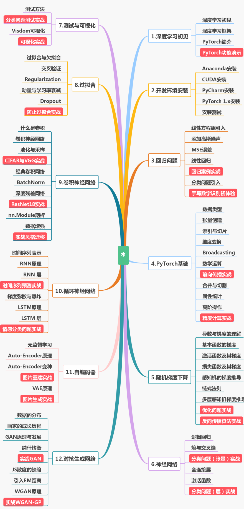

# Pytorch深度学习练习代码
&emsp;&emsp;龙龙（龙曲良）老师的《Pytorch深度学习》是Pytorch入门教材之一。  
&emsp;&emsp;本练习代码主要分为14章+3章选学内容。  
&emsp;&emsp;**申明：** 所有的代码都来源于《Pytorch深度学习》课程，github地址：https://github.com/dragen1860/Deep-Learning-with-PyTorch-Tutorials。

## 使用说明
1. 本练习代码是搭配龙龙老师的《Pytorch深度学习》课程。
2. 关于本笔记中的练习代码，添加了课件中的代码示例，可以很方便地执行程序。  
3. PDF课程讲义目录：res/pdf

## 《Pytorch深度学习》大纲
 
  
- 第1章 深度学习初见
- 第2章 开发环境安装
- 第3章 回归问题
- 第4章 Pytorch基础教程
- 第5章 Pytorch进阶教程
- 第6章 随机梯度下降
- 第7章 神经网络与全连接层
- 第8章 过拟合
- 第9章 卷积神经网络CNN
- 第10章 CIFAR10与ResNet实战
- 第11章 循环神经网络RNN&LSTM
- 第12章 迁移学习-实战宝可梦精灵
- 第13章 自编码器Auto-Encoders
- 第14章 对抗生成网络GAN
- 第15章 选看：Ubuntu开发环境安装
- 第16章 选看：人工智能发展简史
- 第17章 选看：Numpy实战BP神经网络

## 主要贡献者（按首字母排名）
[@胡锐锋-天国之影-Relph](https://github.com/Relph1119)

## 总结

## LICENSE
[GNU General Public License v3.0](https://github.com/relph1119/deeplearning-with-pytorch-notes/blob/master/LICENSE)